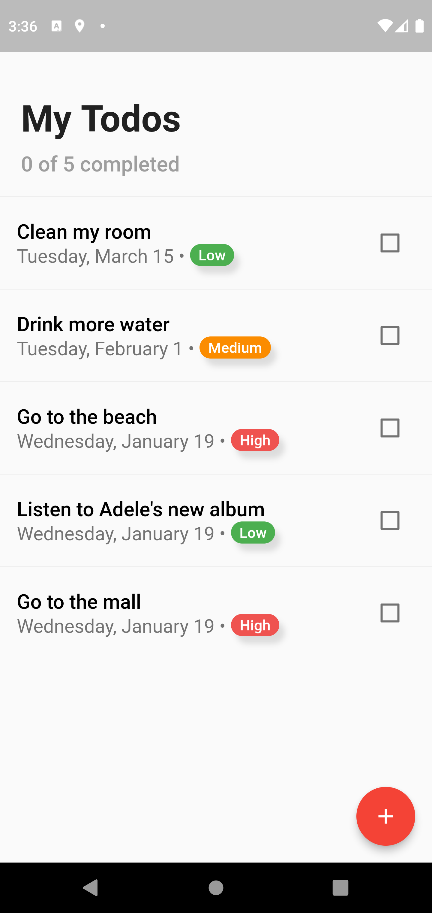
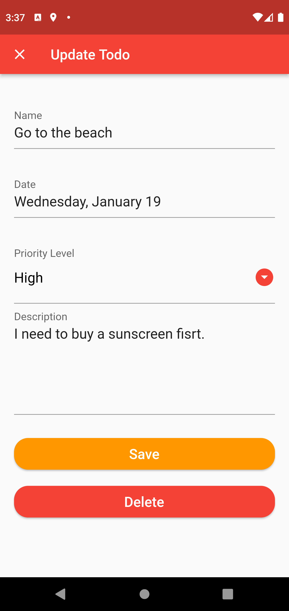
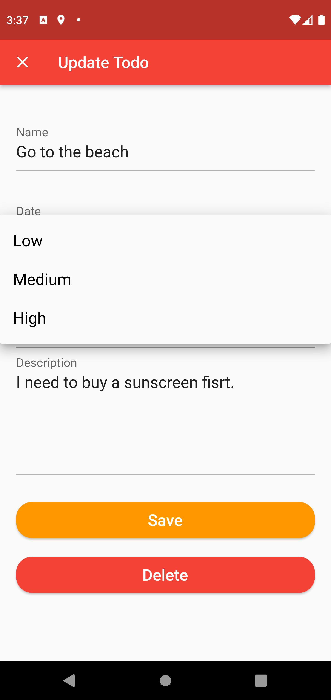
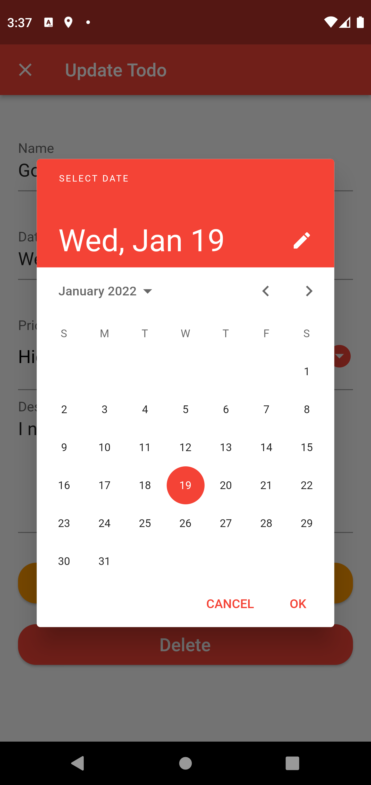
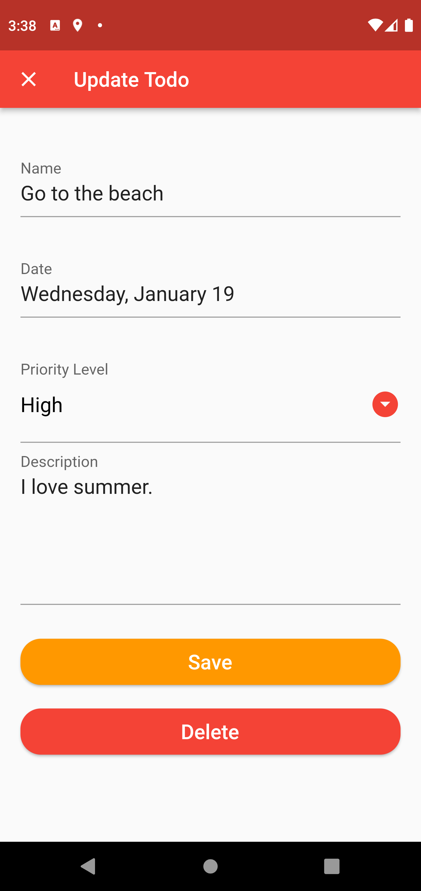
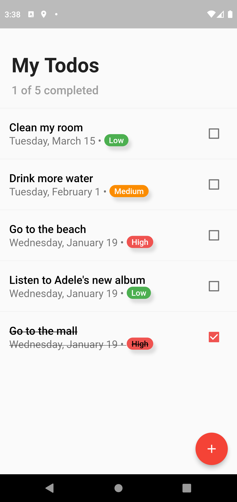
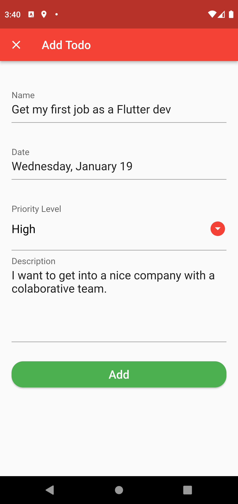
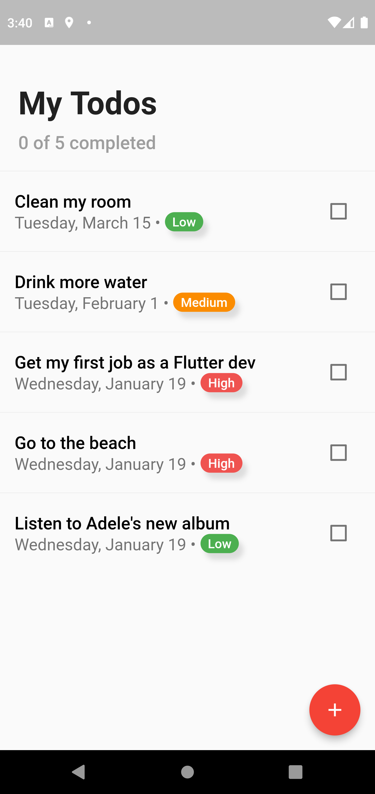

# Todo App with Flutter

A Todo App is generally used to maintain our day-to-day tasks or list everything that we have to do with priority.
It is helpful in planning our daily schedules.

  
  
  
  
  
  
  
  

# App Overview
  
The application is a classic TODO App with CRUD: create (add),  read, update and delete functions.
It also includes a chip flag showing the priority level (low, medium or high), a date picker for selecting
the date and a checkbox in order to mark each todo as completed.

# Supported State Management Solutions
  
- [Cubit](https://pub.dev/packages/flutter_bloc)
  
# Packages 

- [sqflite](https://pub.dev/packages/sqflite)
- [flutter_bloc](https://pub.dev/packages/flutter_bloc)
- [bloc](https://pub.dev/packages/bloc)
- [enum_to_string](https://pub.dev/packages/enum_to_string)
- [intl](https://pub.dev/packages/intl)
- [cupertino_icons](https://pub.dev/packages/cupertino_icons)
- [path_provider](https://pub.dev/packages/path_provider)
- [syncfusion_flutter_datagrid](https://pub.dev/packages/syncfusion_flutter_datagrid)

